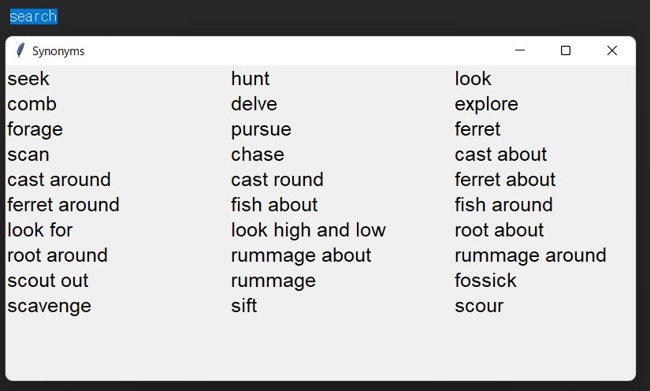

# ENwordsTool

## Requirements

- pyautogui
- keyboard
- tabulate

## Usage



```bash
python main.py
```

- press 'esc' to quit
- press 'ctrl+c' for more than 1 sec to search selected word's synonyms